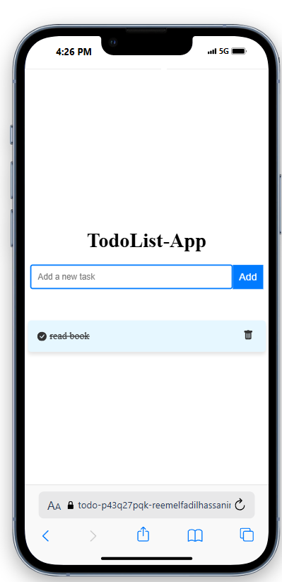

# Todo List App (MERN Stack) 📝

This is a **simple Todo List application** built using the **MERN Stack** (MongoDB, Express.js, React, Node.js). It allows users to **add tasks**, **mark them as done** (with a line-through effect), and **delete tasks** from the list

## Features ✨:
- **Add Task**: Allows the user to add a new task to the list.
- **Mark Task as Done**: Tasks can be marked as completed by clicking on the checkbox, and a line-through is added to the text to indicate that the task is done.
- **Delete Task**: Users can delete a task from the list by clicking the trash icon.

## Technologies Used 🚀:
- **Frontend**: React.js
- **Backend**: Node.js with Express.js
- **Database**: MongoDB (for storing tasks)
- **Icons**: React Icons (for checkboxes and trash can)

## Prerequisites 🛠️:

Before you begin, make sure you have the following installed on your machine:

- [Node.js](https://nodejs.org/) (LTS version)
- [MongoDB](https://www.mongodb.com/try/download/community) (or use MongoDB Atlas)

---

## How to Run the Application 🖥️

### Step 1: Clone the repository

```bash
git clone https://github.com/your-username/todo-app.git
cd todo-app

## the demo  🖥️
https://todo-p43q27pqk-reemelfadilhassanins-projects.vercel.app/


